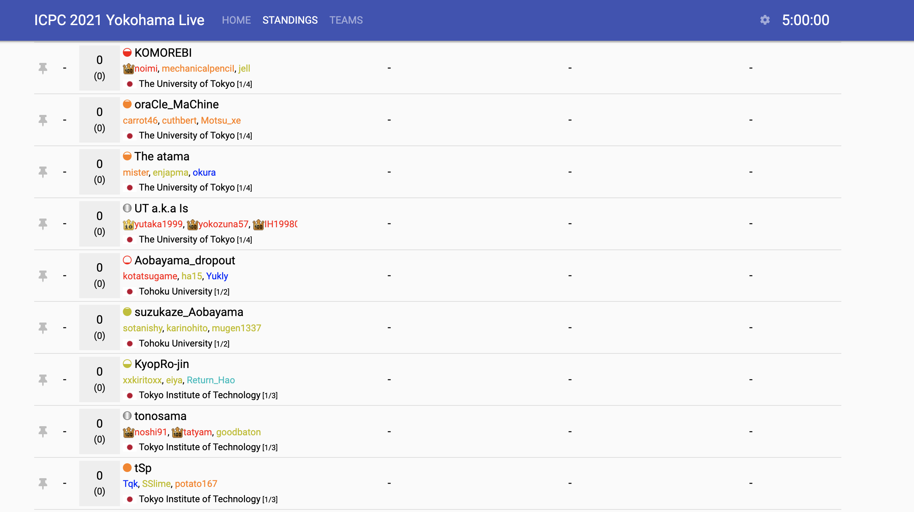

# ICPC Standing Colorizer

- __Install/Update Link: https://github.com/riantkb/icpc_standing_colorizer/raw/master/ICPC-Standings-Colorizer.user.js__

## userscript

- Install/Update Link: https://github.com/riantkb/icpc_standing_colorizer/raw/master/ICPC-Standings-Colorizer.user.js
  - for https://icpcsec.firebaseapp.com/standings/
  - for https://storage.googleapis.com/files.icpc.jp/domestic2025/standings.html
  - requires Tampermonkey

### screenshot

## html
https://riantkb.github.io/icpc_standing_colorizer/

## notes
- This information is from https://jag-icpc.org/?2026%2FTeams%2FList.
- The team ratings are calculated based on https://codeforces.com/blog/entry/16986.
- __情報の真偽に対する一切の責任を負いません。__

